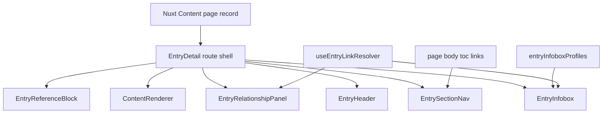

# Stage 18A: Entry Detail Layout & Infobox System Lock

## Purpose

Stage 18A locks the public, reader-facing entry detail system before more lore/content batches resume. The current content corpus is now large enough to expose layout issues: public pages can feel frontmatter-driven, relationship values are not consistently resolved for readers, and section-specific facts are either hidden or rendered too generically.

This stage must improve presentation around the existing data shape. It must not create new lore entries, rename schema fields, add unsupported required fields, rewrite entries to satisfy layout, or touch `public/videos` or `public/fonts`.

Primary sources of truth:

- `plans/notebooklm-taxonomy-guideV2.md`
- `plans/notebooklm-entry-output-contract.md`
- `content.config.ts`
- `app/data/fieldRegistry.ts`
- `app/data/sectionMeta.ts`

## Current Findings

All public sections have detail routes under `app/pages/*/[...slug].vue`. The character route currently has a bespoke layout and all other sections route through `EntryDetail`.

Current reader-facing gaps:

- `app/components/CharacterInfobox.vue` renders four hardcoded rows and uses `Unknown` fallbacks instead of hiding empty fields.
- `app/components/EntryMetaPanel.vue` only renders generic classification/source metadata and ignores most section-specific public fields.
- Relationship fields such as `headquarters`, `leader`, `members`, `owners`, `practitioners`, `related`, and `affiliations` are only resolved by `useRelatedEntries` for bottom-page card groups, not inline infobox rows.
- There is no reusable path-to-title resolver for infobox values.
- There is no contents/tabs component generated from Markdown headings.
- `/titles/*` is already excluded from the relationship allow-list and should stay excluded.
- `/admin` is already `prerender: false` in `nuxt.config.ts`; `/titles` is excluded from the sitemap. Stage 18A should preserve this.

## Target Architecture

## Implementation Plan

### 1. Add a section-aware infobox profile registry

Create `app/data/entryInfoboxProfiles.ts`.

Recommended types:

- `InfoboxFieldKind`: `text`, `chip`, `route-link`, `relationship-row`, `badge`, `list`
- `InfoboxFieldProfile`: `key`, `label`, `kind`, optional `empty`, optional `subtle`, optional `maxItems`, optional `filter`
- `InfoboxProfile`: `section`, `title`, `imageMode`, `fields`

Rules:

- Profiles define field order and reader-facing labels.
- Empty fields are hidden.
- Source/verification fields are allowed only as subtle footer rows or compact badges.
- Backend/editor-only fields should not be prominent.
- No profile should render raw YAML-like keys.

Initial profiles:

- Characters: image/seal fallback, Chinese, Pinyin, Category/Subcategory, Status, Origin, Realm, Titles, Affiliations, Key Relationships.
- Factions: Category, Faction Type, Headquarters, Region, Leader, Members, Teachings, Related Factions.
- World: Category, Location Type, Parent Location, Governing Faction, Region, Inhabitants, Leader, Related Locations.
- Artifacts: Category, Artifact Type, Tier, Origin, Owners, Users, Contains, Stored Items, Related Abilities or Entries.
- Cultivation: Category, Path Type, Realm Level, Realm Range, Practitioners, Related Concepts.
- Teachings: Category, Teaching Type, Key Figures, Related Factions, Related Entries.
- Swordsmanship: Category, Ability Type, Lineage, Users, Related Entries.
- Glossary: Category, Term Type, Related Terms, Denominations, Related Entries.
- Rankings: Category, List Type, Entries, Related Entries.
- Timeline: Category, Date, Era, Location, Participants, Related Entries.
- Pantheon: Category, Being Type, Domain, Territory, Holders, Related Entries.

### 2. Add a reusable link resolver for public display

Create `app/composables/useEntryLinkResolver.ts` or `app/utils/entryLinkResolver.ts` depending on where Nuxt context is needed.

Recommended behavior:

- Query `queryCollection('content').all()` once per page or reuse the same all-entry graph as `useRelatedEntries` if practical.
- Build a `Map<string, record>` for valid public paths only.
- Reuse `isRoutedPath` from `app/utils/relationshipConfig.ts` so `_meta`, `_templates`, and `/titles/*` never link.
- Resolve `/world/haoran-heaven` to `Haoran Heaven` when a record exists.
- Resolve `/characters/chen-pingan` to `Chen Ping'an` when a record exists.
- For a valid-looking route with no record, display a humanized slug as ghost/plain text and do not create a broken link.
- For non-route plain values, display the value as plain text.
- For `/titles/*`, render a gentle plain text label or omit from linkable output according to field context.

Suggested helper API:

- `resolveEntryLink(value): { raw, label, path, exists, isRoute, shouldLink }`
- `resolveMany(values): ResolvedEntryLink[]`
- `humanizePath('/world/haoran-heaven') => 'Haoran Heaven'`

### 3. Replace generic metadata panels with a public EntryInfobox

Create `app/components/EntryInfobox.vue`.

Responsibilities:

- Accept `page`, `section`, and resolved route map/resolver.
- Pick the section profile from `entryInfoboxProfiles.ts`.
- Render image if present, otherwise render a Shuimo seal fallback using `seal`, `chinese`, or first title character.
- Render field groups using profile order.
- Hide empty values.
- Render kinds distinctly:
  - `text`: plain readable row.
  - `chip`: compact seal-style chip.
  - `badge`: status/category/importance badge.
  - `route-link`: one resolved link or ghost/plain label.
  - `list`: list/chip group with route resolution where applicable.
  - `relationship-row`: structured rows for `relationships` objects with display name, relation label, and optional link.
- Keep verification/source notes subtle in a compact footer, not dominant.

Deprecate or stop using `CharacterInfobox.vue` and `EntryMetaPanel.vue` for public detail pages. They may remain in the repo for compatibility, but Stage 18A should route public entry pages through the new `EntryInfobox`.

### 4. Consolidate detail rendering through EntryDetail

Revise `app/components/EntryDetail.vue` so it becomes the common public shell for all sections, including characters.

Responsibilities:

- Render `MediaBanner` or existing character video hero when appropriate.
- Render breadcrumb, polished `NameBlock`, lead description, badges, and section identity.
- Render a responsive article layout with `EntryInfobox` in the sidebar.
- Render `EntrySectionNav` before content or as a sticky compact contents block.
- Render `ContentRenderer` for Markdown body.
- Render `EntryRelationshipPanel` for broader related-entry card groups.
- Render `EntryReferenceBlock` for source notes and verification.

Then simplify `app/pages/characters/[...slug].vue` so it uses `EntryDetail` like the other sections, while preserving character-specific hero behavior via props or page data.

### 5. Add heading-derived contents/tabs

Create `app/components/EntrySectionNav.vue`.

Data source:

- Use `page.body?.toc?.links` where available.
- If Nuxt Content heading IDs differ, inspect the rendered structure during browser QA and adjust link generation only at render layer.

Display behavior:

- Map headings into reader-facing groups/tabs using normalized heading text.
- Expected labels: Overview, Appearance / Personality, History, Cultivation / Abilities, Relationships, Items / Artifacts, Notes, References.
- Generate from actual Markdown headings only. Do not require manual body rewrites.
- Hide groups that do not exist for the current page.
- On mobile, render as a horizontal scroll tab strip or compact contents list.
- On desktop, render as a contained contents rail or compact tab bar that does not feel admin-like.

Heading grouping examples:

- `Appearance`, `Personality` -> Appearance / Personality
- `History`, `Major Events`, `Timeline` -> History
- `Cultivation`, `Abilities`, `Techniques`, `Function` -> Cultivation / Abilities
- `Relationships`, `Known Owners`, `Key Figures`, `Members` -> Relationships or Items / Artifacts depending on section/profile
- `References`, `Source Notes` -> References

### 6. Add relationship-specific public panels

Create `app/components/EntryRelationshipPanel.vue`.

Responsibilities:

- Preserve the existing `RelatedEntries` card-grid behavior for valid resolved outgoing/inverse relationships.
- Use clearer section-aware headings where possible.
- Render `relationships` objects separately as compact structured rows if they are too important for the infobox alone.
- Never show bare route strings.
- Do not render `/titles/*` links.
- Ghost unresolved values gently as plain labels.

This can initially wrap `RelatedEntries` to avoid large behavioral rewrites, then layer structured relationship rows above the existing card grids.

### 7. Add a source/reference block

Create `app/components/EntryReferenceBlock.vue` or revise the existing verification notice area inside `EntryDetail`.

Responsibilities:

- Render `verificationStatus`, `sourceNotes`, `firstAppearance`, and `lastUpdated` subtly.
- Avoid making source fields visually dominant.
- Do not duplicate the body `## References` section content; the body remains authoritative.
- If source notes are absent, use the current gentle fallback text.

### 8. Styling direction

Use existing tokens from `app/assets/css/main.css` and existing components like `SealBadge`, `InkDivider`, `OrnamentalDivider`, `NameBlock`, and `MediaBanner`.

Visual rules:

- Modern cinematic Shuimo identity.
- Fandom-inspired structure without copying Fandom styling.
- Ink-wash image/seal fallback.
- Compact, polished field groups.
- Restrained red seal accents.
- Mobile-first sidebar stacking.
- No generic SaaS/dashboard card feel.
- No heavy colorful gradients.
- Avoid overusing borders.

### 9. Page behavior before and after

Character pages:

- Before: hardcoded 4-row infobox with `Unknown` fallbacks and limited fields.
- After: section profile renders identity, classification, origin, realm, titles, affiliations, and structured relationships. Empty rows disappear.

Faction pages:

- Before: generic category/status/importance only; `headquarters`, `leader`, `members`, and `teachings` are absent from the infobox.
- After: profile renders faction type, headquarters as resolved title/link, leader/members as resolved lists, teachings as chips/links where applicable.

World pages:

- Before: generic metadata only.
- After: location type, parent location, governing faction, region, inhabitants, and leader render section-aware and link-resolved.

Cultivation pages:

- Before: generic metadata only.
- After: path type, realm level/range, practitioners, and related concepts become reader-facing facts.

Artifact pages:

- Before: generic metadata only; owner paths and contents are not surfaced in the infobox.
- After: artifact type, tier, origin, owners/users/contains/stored items render as chips or resolved links, with plain text for non-route contents.

Teaching pages:

- Before: generic metadata only.
- After: teaching type, key figures, related factions, and related entries render with polished chips/links.

Glossary/rankings/timeline/pantheon:

- Before: generic metadata only.
- After: compact profiles surface only useful fields from the implemented schema.

### 10. QA plan

Run after implementation:

1. `npm run editor:qa`
2. `$env:NUXT_PUBLIC_MEDIA_BASE_URL="https://media.jianlai.wiki"; npm run generate`

Manual/browser audit at `http://localhost:3000/`:

- `/characters/chen-pingan`
- `/factions/wen-sheng-lineage`
- `/world/haoran-heaven`
- `/cultivation/middle-five-realms`
- `/artifacts/sword-nurturing-gourd`
- `/teachings/confucianism`
- `/glossary/immortal-money`

Generate verification:

- Confirm generated route count from `npm run generate` output.
- Confirm `/admin` is not prerendered.
- Confirm `/titles` and `/titles/*` are not generated.
- Confirm no `public/videos` or `public/fonts` changes are staged.
- Confirm no new content entries were created.
- Confirm no raw route paths are visible on audited pages.
- Confirm unresolved relationship targets render as gentle plain text, not broken links.
- Confirm mobile layouts do not overlap and infobox/nav stack cleanly.

## Handoff Checklist

- [ ] Implement `app/data/entryInfoboxProfiles.ts`.
- [ ] Implement link resolver helper/composable.
- [ ] Implement `EntryInfobox.vue`.
- [ ] Implement `EntrySectionNav.vue`.
- [ ] Implement `EntryRelationshipPanel.vue`.
- [ ] Implement or revise `EntryReferenceBlock.vue`.
- [ ] Revise `EntryDetail.vue` into the shared public shell.
- [ ] Simplify character detail route to use `EntryDetail`.
- [ ] Preserve all section detail routes and SEO behavior.
- [ ] Run `npm run editor:qa`.
- [ ] Run generate with `NUXT_PUBLIC_MEDIA_BASE_URL` set.
- [ ] Browser-audit required section pages on desktop and mobile.
- [ ] Verify route count, `/admin`, `/titles`, and staged file constraints.

## Deferred Items

- Do not add fields to the NotebookLM output contract in Stage 18A unless a real rendering blocker is discovered.
- Do not migrate existing entries solely for presentation.
- Do not create content entries in this stage.
- Do not redesign the editor architecture beyond tiny shared display helpers if implementation discovers reuse opportunities.

## Recommended Mode Switch

Proceed in Code mode for implementation. The work is scoped to public render-layer components, profile data, link resolution helpers, and verification commands. Content generation should remain paused until QA/generate and visual audits pass.